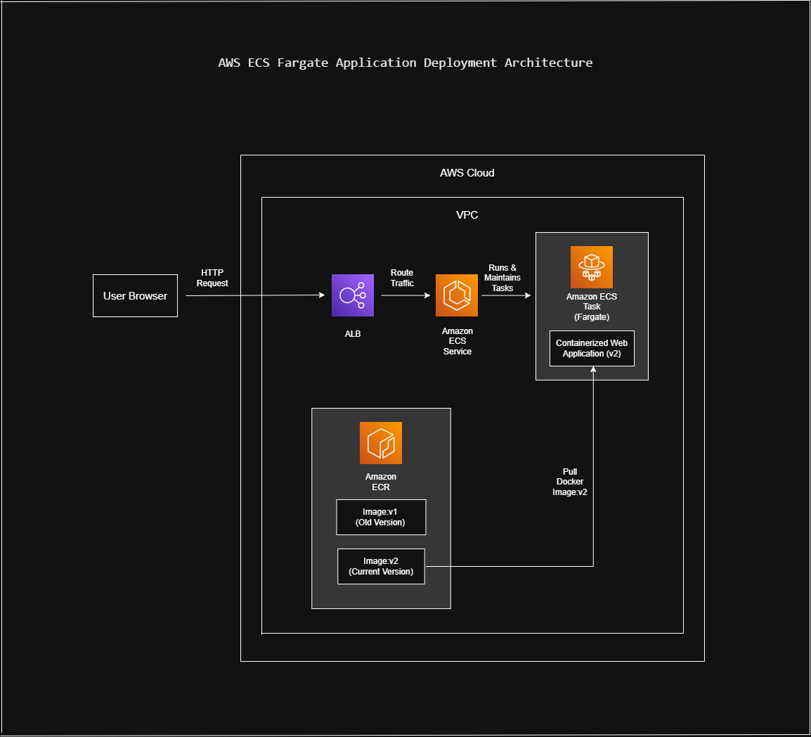
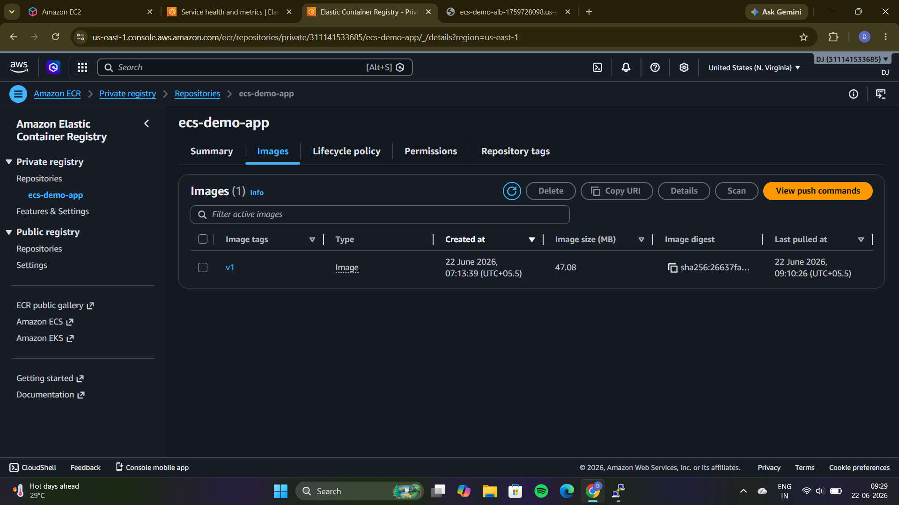
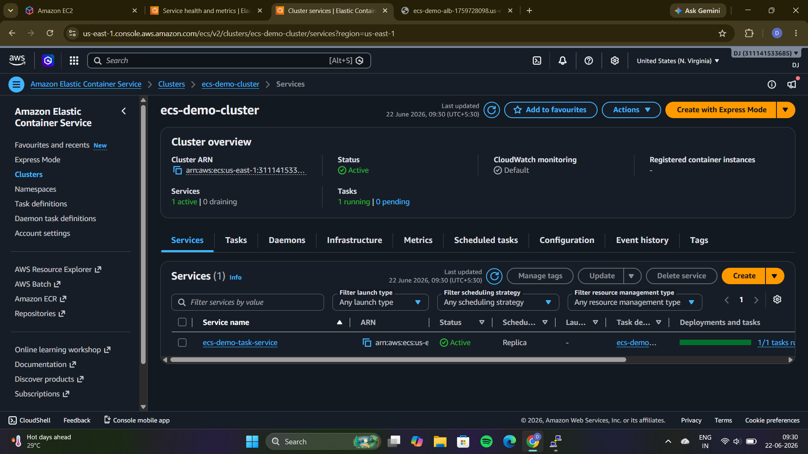
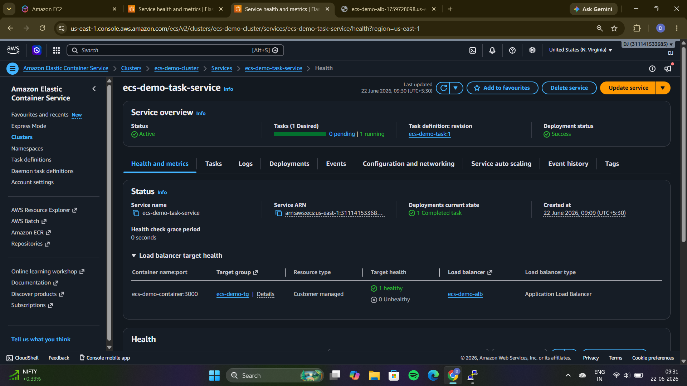
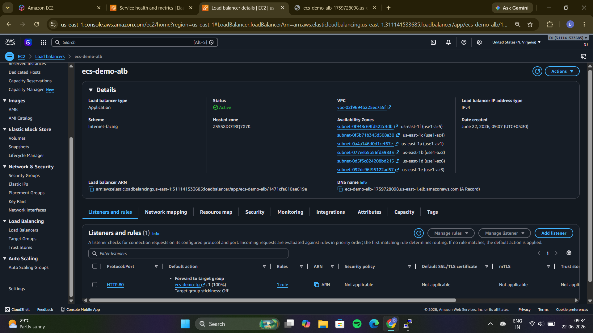
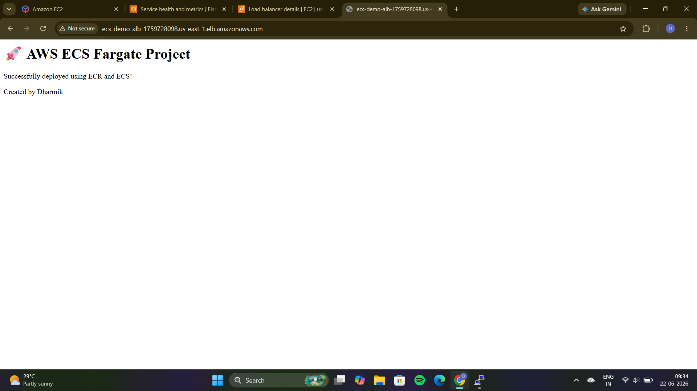
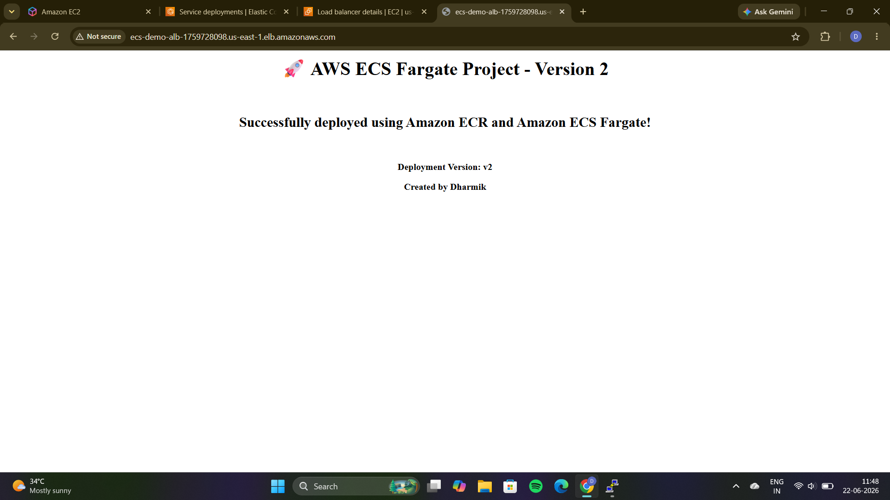

# 🚀 AWS ECS Fargate Application Deployment

## 📖 Project Overview

This project demonstrates how to deploy a containerized web application on Amazon ECS Fargate using Docker, Amazon ECR, and an Application Load Balancer (ALB).

The application is packaged as a Docker image, stored in Amazon Elastic Container Registry (ECR), and deployed as a serverless container on Amazon ECS Fargate. The project also demonstrates application version updates by deploying Version 2 of the application from a new Docker image.

---

## 🏗️ Architecture Diagram

---

## ⚙️ Architecture Flow

1. User sends an HTTP request from a web browser.
2. Application Load Balancer (ALB) receives the request.
3. ALB forwards the request to the Amazon ECS Service.
4. ECS Service manages and maintains the running ECS Task.
5. ECS Task runs the containerized web application on AWS Fargate.
6. The ECS Task pulls the latest Docker image from Amazon ECR.
7. The application response is returned to the user through the ALB.

---

## 🛠️ AWS Services Used

- Amazon ECS (Elastic Container Service)
- AWS Fargate
- Amazon Elastic Container Registry (ECR)
- Application Load Balancer (ALB)
- Amazon VPC
- AWS IAM

---

## 🎯 Project Objectives

- Build and containerize a web application using Docker.
- Store Docker images in Amazon ECR.
- Deploy containers using Amazon ECS Fargate.
- Expose the application using an Application Load Balancer.
- Demonstrate application version updates using image tags.
- Understand the complete container deployment workflow on AWS.

---

## 📸 Project Screenshots

### Amazon ECR Repository

Docker images stored in Amazon Elastic Container Registry.

---

### ECS Cluster Overview

Amazon ECS Cluster running the application service.

---

### ECS Service Health

Healthy ECS service with a running task and successful deployment.

---

### Application Load Balancer

Application Load Balancer routing traffic to the ECS service.

---

### Initial Deployment (Version 1)

First version of the application deployed successfully using ECS Fargate.

---

### Updated Deployment (Version 2)

A new Docker image was pushed to Amazon ECR and deployed through Amazon ECS, demonstrating application version updates.

---

## 📚 Key Learnings

- Containerizing applications using Docker.
- Managing container images with Amazon ECR.
- Deploying containers without managing servers using AWS Fargate.
- Understanding ECS Clusters, Services, Task Definitions, and Tasks.
- Configuring Application Load Balancers for containerized applications.
- Performing application updates through new Docker image versions.
- Understanding the end-to-end container deployment lifecycle on AWS.

---

## ✅ Project Outcome

Successfully deployed a containerized web application on Amazon ECS Fargate using Docker images stored in Amazon ECR and exposed through an Application Load Balancer. The project also demonstrated updating the application by deploying a newer container image version.

---
